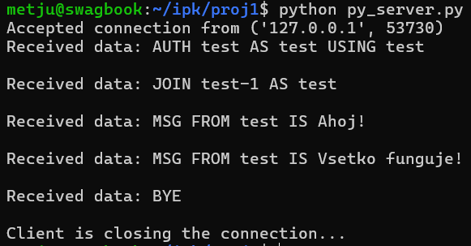

# Client for a chat server using IPK24-CHAT protocol

Matej Olexa (xolexa03) 1.4.2024

## Obsah
[Popis](#popis)  
[Spustenie](#Spustenie)  
[Zoznam odovzdaných súborov](#Zoznam-odovzdaných-súborov)  
[]
## Popis

Implementácia chatovacieho klienta ktorý pomocou použitia IPK24-CHAT[1] protokolu komunikuje s príslušným serverom. Implementácia je robená pre protokoly TCP a UDP.

## Spustenie

`ipk24chat-client -t udp/tcp -s ip_address [-p port] [-d timeout] [-r retransmissions] [-h]`

- `-t` Protokol použitý pre komunikáciu medzi klientom a serverom, musí byť špecifikovaný
- `-s` Ip adresa vzdialeného servru, musí byť špecifikovaná
- `-h` Na štandartný výstup vypíše nápovedu k použitiu
- `-p` Port serveru na ktorý sa klient napája, ak nieje špecifikovaný tak sa používa 4567
- `-d` Časový limit v milisekundách, medzi pokusmi o odoslanie správy v UDP variante klienta
- `-r` Maximálny počet opakovania pokusov o odoslanie správy v UDP variante

#### Príklad použitia

`./ipk24chat-client -t udp -s anton5.fit.vutbr.cz -d 500 -r 3`

## Zoznam odovzdaných súborov

- `argumentParser.cpp`
- `argumentParser.h`
- `client.cpp`
- `client.h`
- `connection.cpp`
- `connection.h`
- `inputParser.cpp`
- `inputParser.h`
- `main.cpp`
- `packet.cpp`
- `packet.h`
- `runner.cpp`
- `runner.h`
- `tcp_client.cpp`
- `tcp_client.h`
- `udp_client.cpp`
- `udp_client.h`
- `Makefile`
- `README`
- `Changelog`
- `./images/Test_cmd.png`
- `./images/wireshark.png`
- `py_server.py`
## Teória 

### TCP

Transmission Control Protocol (TCP) - Protokol riadenia prenosu je jedným z najzákladnejších protokolov používaných pre prenos dát. Tento protokol zaisťuje spoľahlivý prenos dát medzi zariadeniami. Komunikácia pomocou TCP je dosiahnutá cez nadviazanie spojenia medzi klientom a serverom pomocou 3-way-handshake(u), následne sa posielané dáta rozbijú do `segmentov` o menších častiach a každý segment je označený sekvenčným číslom. Tieto sekvenčné čísla sú použité na zabezpečenie správneho poradia a úplnosť dát. Tento proces sa opakuje až pokiaľ niesu všetky dáta úspešne odoslané a potvrdené. [2]

### UDP 

User Diagram Protocol (UDP) - Používateľský datagramový protokol je tzv. "nespoľahlivý" protokol používaný pre prenos dát, ale je podstatne rýchlejší ako TCP. Tento protokol pre prenos dát využíva tzv. `datagramy`. Narozdiel od TCP, komunikácia medzi zariadeniami v UDP nenadviazuje na začiatku žiadne spojenia, ale namiesto toho začne posielať neočíslované dáta bez záruky ich prijatia na druhom konci.[3]
## Implementácia 

Tento projekt bol implementovaný na základe požiadavkov zadania [2]. 
Návrh bol tvorený so zámerom využitia dedičnosti pre spoločnú implementáciu oboch variant protokolov. Hlavná funkcia `main` sa používa na získanie argumentov, a následne zavolanie `Runner::Run()` metódy ktorá je využitá pre beh celého programu. Uložené údaje ako `ip adresa`, `port`, `protokol`, ale aj údaje používané pri pripojení na server ako `display name` a `channel id` sú ukladané v objekte triedy `connection` ktorá sa ako parameter posiela do najnižších oblastí programu. Tento parameter umožňuje multifunkčné využívanie jednotlivých metód pre obe varianty. Metóda `Runner::Run()` vytvára 3 hlavné vlákna `threads` pre načítavanie vstupu, posielanie packetov a príjmanie packetov.

Počas implementácie UDP varianty klienta je kvôli spôsobu fungovania tohto protokolu potrebné uchovávanie informácie o `ID packetu` a posielanie/príjmanie `confirm` správ, čím sa reprodukovala funkcia TCP a nebolo možné použiť spoločné metódy na odosielanie a príjmanie packetov.

## Testovanie

Pre testovanie sa používal jednoduchý server napísaný v pythone, ktorý odosielal správy po prijatí. 
  
Všetky správy boli kontrolované pomocou programu wireshark [4], s IPK24CHAT pluginom [5] 
  

Týmto spôsobom boli kontrolované a odskúšané prípady 
- `Úspešnej autentifikácie`
- `Neúspešnej autentifikácie`
- `Pokusu od autentifikáciu po úspešnej autentifikácie`
- `Pokusu o poslanie správy po neúspešnej autentifikácie`
- `Odosielanie a príjmanie správ`
- `Príjmanie správy mimo protokolu IPK24Chat`
- `Príjmanie správy typu error`
- `Posielanie správy typu error`

Pre testovanie boli taktiež využité aj študentské testy[6], ale je dôležité podotknúť že neboli hlavným spôsobom testovania. Okrem iného boli využité aj pomôcky v Stubs [7].

## Sources
[1] [IPK24Chat Protocol](https://git.fit.vutbr.cz/NESFIT/IPK-Projects-2024/src/branch/master#developer-environment-and-virtualization-remarks)
[2] [Transmission Control Protocol](https://www.fortinet.com/resources/cyberglossary/tcp-ip)  
[3] [UDP](https://www.techtarget.com/searchnetworking/definition/UDP-User-Datagram-Protocol)  
[4] [Wireshark](https://www.wireshark.org/)  
[5] [Wireshark plugin](https://git.fit.vutbr.cz/NESFIT/IPK-Projects-2024/src/branch/master/Project%201/resources)  
[6] [Testy](https://git.fit.vutbr.cz/xhobza03/ipk-client-test-server)
[7] [Stubs](https://git.fit.vutbr.cz/NESFIT/IPK-Projects-2024/src/branch/master/Stubs/cpp)

